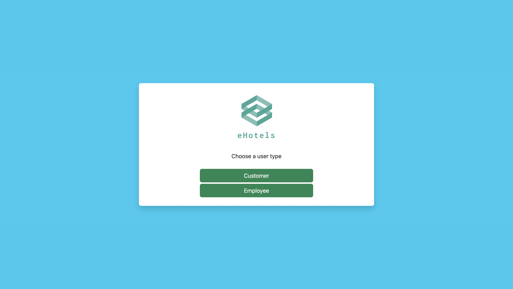
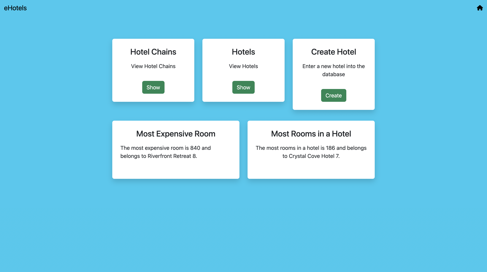
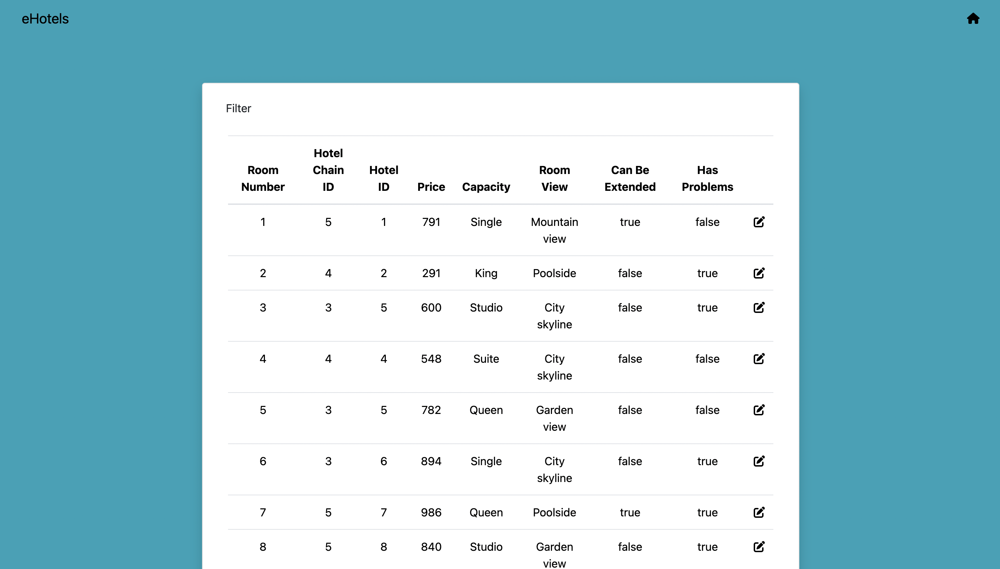
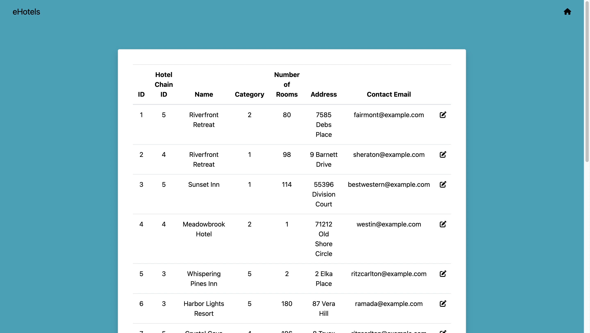

# eHotels

A simple hotel management system allowing room booking, renting and creating. Created using Java, HTML, Bootstrap, JSP, PostgreSQL, Apache Tomcat, pgAdmin and JDBC.

## Screenshots

## Contributors:

- Balpreet Singh
- Oscar Li
- Iyanuloluwa Aketepe